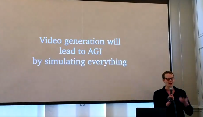

# Minecraft JEPA Image World Model

In this repository, I implement a version of a JEPA Image World Model ([https://arxiv.org/abs/2403.00504](https://arxiv.org/abs/2403.00504)), trained on a subset of OpenAI's Visual PreTraining (VPT) Minecraft contractor dataset. The architecture aims to predict the future state of the Minecraft environment based on an initial frame and a sequence of future actions. Such a World Model should enable Agents to predict the outcome of their actions before performing them, allowing for the optimization of action sequences and improving innate capabilities over time.

  

## Architecture Details

The JEPA Image World Model consists of several components:

1.  Encoder (~113M parameters): A Vision Transformer that takes a single frame at time t=0 as input and produces a latent representation.
2.  Action Conditioning Network (~43M parameters): This network performs cross-attention between the encoded frame representation and the user's keyboard and mouse inputs from time t=-24 to t=0.
3.  Predictor Network (~213M parameters): This network takes the output of the Action Conditioning Network and produces a representation approximating the frame at time t=1.
4.  Diffusion Transformer (~141M parameters): Used for visualization and evaluation purposes.

The model was trained over two weeks on a single NVIDIA RTX 3060 (13GB VRAM). The Encoder's weights are frozen using a moving average, and the Predictor is trained to produce a representation similar to the Encoder's representation of the actual frame at t=1.

## JEPA IWM vs Sora

OpenAI's Sora has recently gained attention, with claims that Video Generation is the key to AGI.

  

The primary benefit of the Sora architecture is the ability to simulate future environments and plan optimal actions based on different simulated outcomes. Sora maps image pixels back to image pixels, which is inherently inefficient, as the generated video needs to be converted back into latent space for planning.

JEPA World Models, on the other hand, encode the environment into a latent space representation and produce future versions of the environment while maintaining this representation. The diffusion model is secondary, and simply utilized for evaluation of the model rather than being the primary purpose. It seems that keeping the representation of the environment in latent space allows for the retention of invariant representations, which should make downstream applications much more efficient and effective.

  

## Potential Scale Implications

The JEPA Image World Model and Sora architectures are very similar, as it seems the major difference is that JEPA IWMs don't need the final diffusion transformer to perform the World Modeling.

  

According to a [recent report](https://www.factorialfunds.com/blog/under-the-hood-how-openai-s-sora-model-works) by Factorial Funds, the entire Sora architecture is estimated to have ~20B parameters. This implies that the base compute shown above totals ~600M parameters. Given our entire architecture (including the Diffusion Transformer we use simply for evaluation) is ~400M parameters, even the Sora base compute case is approximately 1.5x the compute of our JEPA Image World Model.

  

It will be interesting to see the performance of JEPA World Models when scaled up to a similar level as Sora.